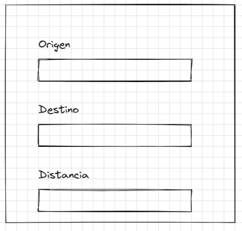
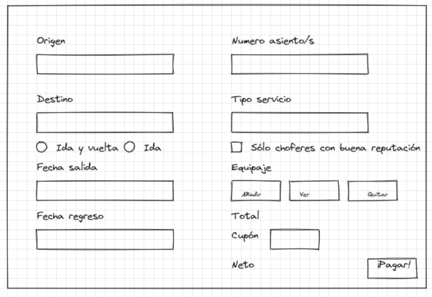
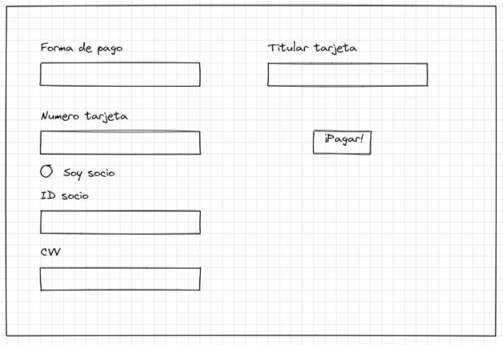

# arrow-bus
Repositorio de trabajo de cursos de programación CEU 2S 2021 (Python y Java)

# Descripción del problema

Arrow, cansado de pelear en Star City ha emprendido un viaje a la ciudad de Córdoba para poner una empresa de transporte, ya que ve que tiene potencial en esa área de negocios.

Sin embargo, carece de un sistema que le permita administrar, vender y obtener datos de las ventas y nos solicita que lo hagamos.

Este sistema cuenta de dos partes:

- Una parte escrita en Python que sirve un servicio APIRest para añadir nuevos destinos y generar los resúmenes de sueldo de los choferes además de obtener los datos de las ventas.
- Una parte escrita en Java que sirve para vender los pasajes y generar la orden de pago para los clientes.

Dado que Arrow está corto de presupuesto, la base de datos a usar es compartida en ambas aplicaciones.

Arrow nos brinda una seria de gráficos para guiar al equipo de desarrollo en la UI/UX:

# Aplicación en Python

# Aplicación en Java

Arrow nos dio este esquema, pero puede modificarse sin problemas.

En la próxima reunión definiremos los requerimientos y cómo trabajeremos en el proyecto.